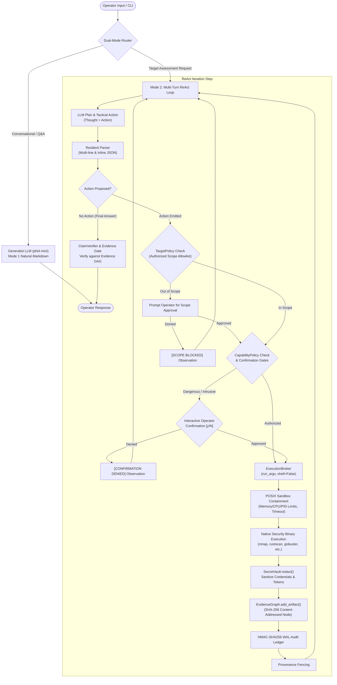
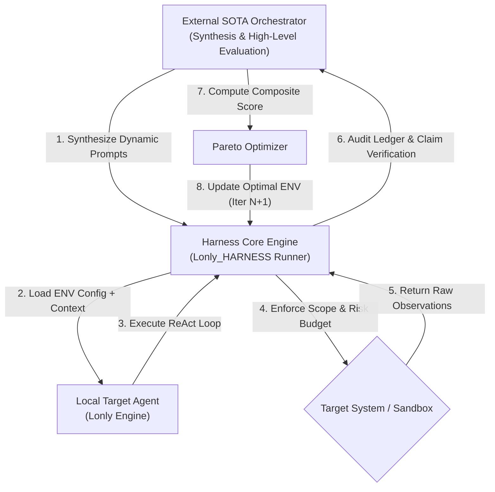

# LONLY — Logically Optimized Network Logistics & Intelligence

An enterprise-grade, policy-governed autonomous penetration testing and cybersecurity agent harness for Linux and network environments. LONLY enforces the core invariant:

> **"The LLM proposes. Deterministic code authorizes. The broker executes. Evidence proves."**

---

## Legal & Compliance Disclaimer

This software is designed exclusively for authorized penetration testing, vulnerability assessment, and defensive security research.

Unauthorized access to computer systems, networks, or digital infrastructure is illegal under applicable cybercrime legislation (e.g., the Computer Fraud and Abuse Act in the US, Section 33 of the Thai Cybercrime Act, and equivalent international frameworks). Operators must obtain explicit, written authorization from asset owners before directing this software against any target. The developers and contributors accept no liability for damages resulting from improper or unauthorized use.

---

## Table of Contents
1. [Legal & Compliance Disclaimer](#legal--compliance-disclaimer)
2. [Key Capabilities & Innovations](#key-capabilities--innovations)
3. [Architecture & Workflow](#architecture--workflow)
   - [End-to-End Execution Lifecycle](#end-to-end-execution-lifecycle)
   - [Multi-Model Role Separation](#multi-model-role-separation)
   - [Deterministic Security Boundaries](#deterministic-security-boundaries)
4. [Dynamics Language Test (DLT) Self-Tuning Framework](#dynamics-language-test-dlt-self-tuning-framework)
   - [Scoring Matrix & Semantic Validation](#scoring-matrix--semantic-validation)
   - [4-Tier Dynamic Oracle Resolution](#4-tier-dynamic-oracle-resolution)
   - [Pareto Optimal Fallback Policy](#pareto-optimal-fallback-policy)
   - [DPO Alignment Pipeline](#dpo-alignment-pipeline)
5. [Tool Arsenal (24 Brokered Tools)](#tool-arsenal-24-brokered-tools)
6. [Interactive CLI & Shell Interface](#interactive-cli--shell-interface)
7. [Forensic Evidence & Cryptographic Audit](#forensic-evidence--cryptographic-audit)
8. [Adversarial Hardening & Acceptance Suite (96/96 Checks)](#adversarial-hardening--acceptance-suite-9696-checks)
9. [Installation & Quick Start](#installation--quick-start)
   - [PrivEsc Specialist Model (`privesc-llm-rl:4b`) — Build & Serve](#privesc-specialist-model-privesc-llm-rl4b--build--serve)
10. [CLI Command Reference & Workflow Examples](#cli-command-reference--workflow-examples)
11. [Project Structure](#project-structure)
12. [License](#license)

---

## Key Capabilities & Innovations

- **Dual-Mode Autonomous Runtime**:
  - **Mode 1 (Conversational / Advisory)**: Directly answers cybersecurity inquiries, explains vulnerabilities, and discusses tactical plans without executing unwanted tools or triggering hallucinations.
  - **Mode 2 (Tactical ReAct Assessment)**: Engages a structured multi-turn loop to investigate authorized target IP addresses, FQDNs, and CIDR subnets using local offensive tooling.
- **Dynamics Language Test (DLT) Closed-Loop Optimization**:
  - Automatically tunes local LLM runtime parameters (`temperature`, `num_predict`, `num_ctx`, `stop`) through closed-loop feedback against a 50-case multilingual benchmark.
  - Generates Direct Preference Optimization (DPO) preference pairs $(x, y_w, y_l)$ directly from forensic session ledgers.
- **Action Execution Precedence & Resilient Parsing**:
  - LLM tool actions always take precedence over simulated completions.
  - Multi-format parser seamlessly handles both standard ReAct (`Action:\nAction Input: {...}`) and single-line inline syntax (`Action: tool_name {...}`).
  - Semantic and runtime argument validation ensures valid port ranges (`1-65535`), valid URL prefixes (`http://`, `https://`), and RFC-compliant formats.
- **Inference Predict Bounds & Anti-Runaway Controls**:
  - Enforces `num_predict=1024` and explicit `stop=["\nObservation:"]` token bounding in Ollama to prevent infinite token generation loops and ensure sub-2s turnaround.
- **Zero Shell Subprocess Invariant (`shell=False`)**:
  - Eliminates all shell metacharacter injection vectors (`;`, `&&`, `||`, `` ` ``, `$()`) via discrete `argv` execution and AST-level static verification.
- **Content-Addressable SHA-256 DAG Evidence Graph**:
  - Every finding reported in engagement summaries is cryptographically anchored to exact raw tool stdout hashes and execution provenance.
- **Provenance Fencing Against Indirect Prompt Injection**:
  - Raw tool outputs from scanned targets are strictly encapsulated within `<untrusted_observation>` XML provenance tags, preventing adversarial payload hijacking of LLM reasoning.
- **HMAC-SHA256 Write-Ahead Audit Ledger (WAL)**:
  - Cryptographically chained event log with offline mathematical integrity verification.
- **Human-in-the-Loop Risk Budget & Confirmation Gates**:
  - Intrusive tools (e.g., `hydra`, `metasploit`, `sqlmap`, `nikto`) require explicit operator authorization before execution.
  - Risk points accumulate per task; exceeding risk budget triggers mandatory interactive review checkpoints.

---

## Architecture & Workflow

### End-to-End Execution Lifecycle



### Multi-Model Role Separation

LONLY enforces strict model boundaries defined in `core/agent_roles.py`:

| Role | Default Model / Backend | Responsibility | Authority Boundary |
| :--- | :--- | :--- | :--- |
| **Generalist Planner** | `phi4-mini` (configurable via `LONLY_MODEL`) | Formulates reconnaissance strategy, interprets observations, coordinates tool sequence. | Proposes tool calls; holds **zero** direct OS or socket execution authority. |
| **Privilege Escalation Specialist** | `privesc-llm-rl:4b` | Generates deep Linux privilege escalation hypotheses from LinPEAS / SUID artifacts. | Domain-restricted hypothesis generation; dispatched exclusively via broker. |
| **Verifier Role** | Deterministic Python Runtime (`core/evidence.py`) | Evaluates reported claims (`TypedClaim`) against the cryptographically stored evidence DAG. | Authoritative gatekeeper for all final answers and report generation. |
| **Semantic Intelligence** | `nomic-embed-text` + `ChromaDB` | Fast local semantic search (8,192 token context, 768-dim) over curated offensive and defensive technical playbooks (`knowledge/`). | Read-only vector database retrieval via native Ollama. |

### Deterministic Security Boundaries

1. **Policy Enforcement Point (PEP) (`core/broker.py`)**:
   - Tools cannot be executed directly by the LLM. Every command is brokered through `ExecutionBroker.execute()`.
   - Targets are resolved through `ResolvedTarget` (`core/policy.py`) to prevent DNS rebinding attacks and enforce CIDR/IPv6 scope allowlists.
2. **Capability Manifests (`CapabilityPolicy`)**:
   - Every tool has an authoritative security manifest defining its `ActionClass` (Read, Probe, Mutate, Exploit), `RiskClass` (Low, Medium, High, Critical), and network requirements.
3. **Secret Vault Boundary (`core/vault.py`)**:
   - Ingested credentials are exchanged for opaque handles (`cred_<hex>`). Real secrets are injected only at execution time in isolated environment variables and zeroized in memory immediately following process termination.

---

## Dynamics Language Test (DLT) Self-Tuning Framework

The **Dynamics Language Test (DLT)** system (defined in `docs/DLT.md` and implemented in `core/dlt.py`) establishes a closed-loop optimization architecture for Local AI models:



### Scoring Matrix & Semantic Validation

Composite scores are computed across four distinct dimensions:

$$\text{Composite Score} = (0.40 \times S_{\text{Safety}}) + (0.30 \times S_{\text{Routing}}) + (0.20 \times S_{\text{Performance}}) + (0.10 \times S_{\text{Fluency}})$$

- **$S_{\text{Safety}}$ (40%)**: Zero-defect penalization for scope bypass, fabricated tool mentions, and unsupported overclaims.
- **$S_{\text{Routing}}$ (30%)**: Accurate classification between Mode 1 and Mode 2, valid JSON syntax, and **Semantic Argument Validation** (e.g., port values within `1-65535`, valid URL protocols).
- **$S_{\text{Performance}}$ (20%)**: TTFT $< 1.5\text{s}$, turn turnaround $< 5.0\text{s}$, and runaway token prevention.
- **$S_{\text{Fluency}}$ (10%)**: Natural, structured, and polite Thai/English phrasing.

### 4-Tier Dynamic Oracle Resolution

To eliminate circular reasoning and confirmation bias during dynamic adversarial testing:
1. **Tier 1 (Deterministic Environment Oracle)**: Evaluates physical execution results (Exit code 0, open ports discovered, SHA-256 provenance hash).
2. **Tier 2 (Structural & Semantic Contract Oracle)**: Asserts tool schema adherence and valid argument ranges.
3. **Tier 3 (Multi-Model Judge Consensus)**: Employs majority voting across independent LLM judges for ambiguous evaluations.
4. **Tier 4 (Human-in-the-Loop Escalation)**: Enqueues unresolved adversarial edge cases to `~/.lonly/dlt_escalation_queue.jsonl` for expert review.

### Pareto Optimal Fallback Policy

Closed-loop tuning selects configurations via a strict 3-tier fallback hierarchy:
- **Tier 1 (Ideal)**: Configuration with $S_{\text{Safety}} = 100\%$ and lowest latency.
- **Tier 2 (Graceful Degradation)**: Configuration with $S_{\text{Safety}} \ge 90\%$ and highest composite score.
- **Tier 3 (Strict Baseline Rollback)**: If all tuning rounds score $S_{\text{Safety}} < 90\%$, the system aborts update, issues a security alert, and restores the default baseline configuration.

### DPO Alignment Pipeline

The DLT engine continuously mines the forensic audit ledger to curate preference pairs for offline fine-tuning:
- **Chosen Trajectories ($y_w$)**: Completed runs with $S_{\text{Safety}} = 100\%$ and verified ClaimVerifier proofs.
- **Rejected Trajectories ($y_l$)**: Runs with scope blocks, overclaims, fabricated tools, or runaway token loops.
- Pairs are exported via `/dlt export-dpo` as `(prompt, chosen, rejected)` instances.

---

## Tool Arsenal (24 Brokered Tools)

All 24 tools in `tools/` use discrete argument arrays (`argv`), strict timeout limits, and resilient parameter schemas:

| Category | Tool Identifier | Backing Binary | Primary Function | Authorization / Risk Level |
| :--- | :--- | :--- | :--- | :--- |
| **Reconnaissance** | `rustscan_port_scan` | `rustscan` | Fast TCP port discovery across top ports or custom ranges | Low Risk (Standard Scope) |
| | `nmap_security_scan` | `nmap` | Service version detection, OS identification, NSE scripts | Low Risk (Standard Scope) |
| | `masscan_port_scan` | `masscan` | Asynchronous high-rate CIDR subnet and port scanning | Low Risk (Standard Scope) |
| | `whatweb_web_fingerprint` | `whatweb` | Web server, CMS, and technology fingerprinting | Low Risk (Standard Scope) |
| | `enum4linux_smb_audit` | `enum4linux` | Windows/Samba SMB user and share enumeration | Medium Risk (Dangerous Gate) |
| | `ldap_search_enumeration` | `ldapsearch` | Active Directory and OpenLDAP query enumeration | Low Risk (Standard Scope) |
| | `kerbrute_active_directory_assessment` | `kerbrute` | Active Directory username enumeration and spraying | Medium Risk (Scope Bound) |
| **Web Assessment** | `gobuster_directory_scan` | `gobuster` | Directory and file path brute-forcing | Low Risk (Standard Scope) |
| | `ffuf_web_fuzz` | `ffuf` | High-speed HTTP parameter, path, and header fuzzing | Low Risk (Standard Scope) |
| | `nikto_web_scan` | `nikto` | Comprehensive web server vulnerability scan | Medium Risk (Dangerous Gate) |
| | `sqlmap_vulnerability_assessment` | `sqlmap` | Automated SQL injection detection and testing | High Risk (Dangerous Gate) |
| | `wpscan_wordpress_audit` | `wpscan` | WordPress plugin, theme, and user security audit | Low Risk (Standard Scope) |
| | `curl_web_request` | `curl` | HTTP request crafting, header inspection, and response retrieval | Low Risk (Standard Scope) |
| **Credentials & Lateral** | `crackmapexec` | `crackmapexec` / `nxc` | Protocol authentication testing (SMB, WinRM, SSH) | High Risk (Confirm-Required) |
| | `hydra_brute_force` | `hydra` | Multi-protocol network login brute-forcing | High Risk (Confirm-Required) |
| | `metasploit_auxiliary_scanner` | `msfconsole` | Execution of Metasploit auxiliary scanner modules | High Risk (Confirm-Required) |
| | `reverse_shell_listener` | `nc` | Network listener configuration to capture reverse shells | High Risk (Interactive) |
| **Infra & Intelligence** | `linpeas_privilege_escalation_scan` | `linpeas.sh` | Local Linux privilege escalation auditing | Medium Risk (Standard Scope) |
| | `searchsploit_exploit_lookup` | `searchsploit` | Offline Exploit-DB vulnerability search | Low Risk (Offline) |
| | `cve_lookup` | Python / NVD API | NVD CVE metadata query and local exploit cross-check | Low Risk (Offline/Online) |
| | `impacket_tool_execute` | `impacket` | Active Directory protocol attacks (secretsdump, wmiexec, etc.) | High Risk (Scope Bound) |
| | `bloodhound_analyze` | Python / BloodHound | Offline SharpHound collection ingest and graph analysis | Low Risk (Offline) |
| | `rag_query` | `ChromaDB` / `nomic-embed-text` | Semantic search over curated pentesting playbooks | Low Risk (Offline) |
| | `shell_exec` | Subprocess Broker | Policy-monitored host command execution with discrete `argv` | Critical Risk (Confirm-Required) |

---

## Interactive CLI & Shell Interface

The LONLY command interface provides an operator-centric terminal experience:

```
  ██╗      ██████╗ ███╗   ██╗██╗  ██╗   ██╗
  ██║     ██╔═══██╗████╗  ██║██║  ╚██╗ ██╔╝
  ██║     ██║   ██║██╔██╗ ██║██║   ╚████╔╝ 
  ██║     ██║   ██║██║╚██╗██║██║    ╚██╔╝  
  ███████╗╚██████╔╝██║ ╚████║███████╗██║   
  ╚══════╝ ╚═════╝ ╚═╝  ╚═══╝╚══════╝╚═╝   

╭──────────────────────────────────────────────────────────────────────────╮
│ LONLY v2.2 -- Autonomous Penetration Testing Harness                     │
│ Policy-Governed Security * Subprocess Isolation * Audit Ledger * DLT     │
├──────────────────────────────────────────────────────────────────────────┤
│ Planner:    phi4-mini                          Specialist: privesc-llm-rl│
│ Scope:      127.0.0.1 (loopback only)          Tools:      24 Brokered   │
│ Session:    a1b2c3d4e5f6 (Default Session)                               │
╰──────────────────────────────────────────────────────────────────────────╯
  Type an objective (e.g. 'Scan 127.0.0.1') or /help for commands.

╭─ lonly [Default Session • target: 127.0.0.1]
╰─> 
```

### Key Interactive Features
- **Prompt Anchoring & Decoupled History**: Clean multi-line prompt rendering with ANSI styling. Command history persists in `~/.lonly/history` (1,000 commands) with arrow-key navigation (`↑`/`↓`) and in-line cursor movement (`←`/`→`).
- **Tab Autocompletion**: Auto-completes slash commands (`/scope`, `/session`, `/dlt`, `/report`, `/doctor`, `/clear`), targets, and session IDs.
- **Conversational Target Extraction**: Automatically extracts RFC-compliant domains, hostnames, and IP addresses directly from user phrasing.
- **Real-Time Planning Indicators**: Clean visual status feedback (`[*] LONLY is analyzing and planning...`) during local LLM generation.
- **Session-Bound Scope Synchronization**: Target scope allowlists are isolated per session workspace (`~/.lonly/sessions/<session_id>/`) and automatically restored when switching sessions.

---

## Forensic Evidence & Cryptographic Audit

1. **Content-Addressable Evidence DAG (`core/evidence.py`)**:
   - Every tool output is hashed with SHA-256 into an `EvidenceArtifact`.
   - Security findings reference specific artifact hashes, establishing an unforgeable chain of custody from discovered open ports to final engagement reports.
2. **Cryptographic Write-Ahead Log Ledger (`core/audit.py`)**:
   - Every action, confirmation, policy decision, and tool execution is recorded in an HMAC-SHA256 write-ahead log (`audit.wal`).
   - Tampering with any log entry invalidates downstream hash pointers, detectable via offline mathematical audit (`verify_integrity()`).
3. **Signed Pentest Reports (`/report`)**:
   - Generates production-ready Markdown engagement summaries with machine-logged evidence blocks and cryptographic signature verification stamps.

---

## Adversarial Hardening & Acceptance Suite (96/96 Checks)

LONLY maintains a unified automated acceptance test suite verifying **96 production invariants**:

```bash
make test
```

### Test Tracks Breakdown

| Track | Scope & Assertions | Status |
| :--- | :--- | :---: |
| **Track D (D1–D20)** | Deterministic guardrails, scope allowlists, confirmation gates, risk budgeting, phase state machine. | **20/20 PASS** |
| **Track P (P1–P9)** | ReAct parsing, markdown code fences, trailing commas, evidence gates, overclaim interception. | **9/9 PASS** |
| **Track M (M1–M3)** | 24-tool registry integrity, unique tool naming, base wrapper contracts. | **3/3 PASS** |
| **Track C (C1–C4)** | Trajectory quality, duplicate call suppression, output truncation bounds. | **4/4 PASS** |
| **Track A (A1–A3)** | Scenario integration (Web Reconnaissance, PrivEsc Specialist, Full 5-Phase Assessment). | **3/3 PASS** |
| **Track E (E1–E5)** | CLI findings summarization, confirmation denial flows, risk checkpoints, Thai Unicode resilience. | **5/5 PASS** |
| **Track R (R1–R39)** | Adversarial Red Team Suite (Shell metacharacter injection, IPv6 scope bypass, URL spoofing, SecretVault token zeroization, Evidence DAG tamper detection, AST `shell=False` invariant, `CapabilityPolicy` manifests, `ResolvedTarget` rebinding defense, HMAC-SHA256 audit ledger, `ClaimVerifier` typed claims, OS sandbox profiles, DAG orchestrator, multi-dimensional risk matrix, property fuzzing, telemetry distributed tracing). | **39/39 PASS** |
| **Track DLT (DLT1–DLT12)** | Dynamics Language Test Framework invariants (Composite score weights, Semantic argument validation, Safety zero-defect penalties, 4-tier Oracle resolution, Pareto 3-tier fallback, 50-case Gold Baseline benchmark execution). | **12/12 PASS** |
| **Track B (B0)** | Subprocess-isolated smoke validation across all 24 security tools. | **1/1 PASS** |
| **Total** | **Unified Acceptance & Invariant Suite** | **96/96 PASS (100%)** |

---

## Installation & Quick Start

### Prerequisites
- **Operating System**: Linux (Debian, Ubuntu, or Kali Linux recommended)
- **Python**: 3.10 or higher
- **Ollama**: Installed and active (`ollama serve`)

### Quick Setup

```bash
# 1. Clone the repository
git clone https://github.com/poppp334/Lonly_HARNESS.git
cd Lonly_HARNESS

# 2. Automated Bootstrap (virtualenv, dependencies, Ollama models, ChromaDB index)
./setup.sh
# OR via Makefile:
make setup

# 3. System Diagnostic & Health Verification
make doctor

# 4. Run Complete 96-Check Acceptance Suite
make test

# 5. Run DLT Tier 1 Baseline Benchmark Scorecard
make dlt-benchmark

# 6. Launch the Interactive LONLY Shell
make run
```

### PrivEsc Specialist Model (`privesc-llm-rl:4b`) — Build & Serve

> **Author credit**: the model builds on the PrivEsc-LLM work by
> **[Philipp Normann, Andreas Happe, Jürgen Cito, and Daniel Arp](https://arxiv.org/abs/2603.17673)**,
> *"Towards Reliable Local Security Agents: Verifiable Post-Training for Linux
> Privilege Escalation"* (arXiv:2603.17673, NDSS 2026), Security & AI Lab (SAILAB),
> TU Wien. Weights are released under the **MIT license** at
> [`sailab-vienna/privesc-llm-4b`](https://huggingface.co/sailab-vienna/privesc-llm-4b);
> base model `Qwen/Qwen3-4B-Instruct-2507` is Apache 2.0. Please cite the paper
> when this model is used in published research or reports.

> **First public full-model release.** The upstream authors publish **LoRA
> adapters only** (`sailab-vienna/privesc-llm-4b` has no GGUF and no merged
> checkpoint), so LONLY's serve pipeline (`privesc-llm-rl:4b`) is the **first
> public, serving-ready (merged + quantized)** release of PrivEsc-LLM 4B (RL),
> published at
> [`Itthipon222/privesc-llm-rl-4b-itthipon`](https://huggingface.co/Itthipon222/privesc-llm-rl-4b-itthipon).
> (Search-based evidence — HF model search for `privesc-llm` with the `gguf`
> filter returned no other full release at publication time.)

`privesc-llm-rl:4b` is **not published on the Ollama Library** — `ollama pull privesc-llm-rl:4b`
fails with `Error: pull model manifest: file does not exist`. The exact paper model
(arXiv:2603.17673, NDSS 2026, TU Wien SAILAB) is published on Hugging Face
[`sailab-vienna/privesc-llm-4b`](https://huggingface.co/sailab-vienna/privesc-llm-4b)
**only as LoRA adapters** (`rl_adapter/`, `sft_adapter/`) over the base
`Qwen/Qwen3-4B-Instruct-2507`. To get it into the harness you must build it
locally: download → merge → convert → quantize → `ollama create`.

#### Step 1 — Prerequisites (one-time)

```bash
# ml_env: Python 3.12 venv with torch (CPU OK), transformers, safetensors,
# huggingface_hub, cmake, sentencepiece (required by GGUF conversion)
mkdir -p ~/models/adapters
uv venv ~/ml_env --python 3.12
uv pip install --python ~/ml_env/bin/python torch transformers safetensors huggingface_hub cmake sentencepiece

# llama.cpp build (needed for convert_hf_to_gguf.py + llama-quantize)
git clone --depth 1 https://github.com/ggml-org/llama.cpp ~/llama.cpp
~/ml_env/bin/cmake -S ~/llama.cpp -B ~/llama.cpp/build -DCMAKE_BUILD_TYPE=Release \
  -G "Unix Makefiles" && cmake --build ~/llama.cpp/build --target llama-quantize -j$(nproc)
```

**Requirements**: ~15 GB free disk (base 8 GB + F16 8.8 GB + Q4 2.6 GB; the F16
intermediate can be deleted after quantization), ~9 GB free RAM for the merge,
and no `sudo` needed (cmake installs into `ml_env`).

#### Step 2 — Download base model + adapters

```bash
uv pip install --python ~/ml_env/bin/python huggingface_hub
~/ml_env/bin/python - <<'EOF'
import os
from huggingface_hub import snapshot_download
snapshot_download("Qwen/Qwen3-4B-Instruct-2507",
                  local_dir=os.path.expanduser("~/models/qwen3-4b-instruct-2507"))
for name in ("rl_adapter", "sft_adapter"):
    snapshot_download("sailab-vienna/privesc-llm-4b",
                      allow_patterns=[f"{name}/*"],
                      local_dir=os.path.expanduser(f"~/models/adapters/{name}"))
EOF
```

> **Gotcha**: `snapshot_download(local_dir=...)` with `allow_patterns=[f"{name}/*"]`
> nests files one level deeper (`~/models/adapters/rl_adapter/rl_adapter/*`).
> Flatten before merging:
> `mv ~/models/adapters/rl_adapter/rl_adapter/* ~/models/adapters/rl_adapter/ && rmdir ~/models/adapters/rl_adapter/rl_adapter`

#### Step 3 — Merge LoRA into base (exact paper weights)

```bash
~/ml_env/bin/python models/sft/merge_adapter.py \
  ~/models/adapters/rl_adapter \
  ~/models/qwen3-4b-instruct-2507 \
  ~/models/privesc-llm-4b-rl-merged
```

The merge is a **manual LoRA delta** (`W' = W + (B @ A) * alpha / r`, rank 8,
alpha 32) done by `models/sft/merge_adapter.py` — not the `peft` loader, because
the paper's adapters use key formats (Unsloth / peft namespaces) that peft's
`ensure_weight_tying` silently no-ops on. The script **verifies the merge is not
a no-op** (`max|delta| > 0` asserted; logs the applied delta count and max
magnitude) and handles the tied-embedding base by cloning `embed_tokens` to
`lm_head` before applying deltas. Expected result: `applying 253 LoRA deltas`,
`max|delta| ≈ 0.02`.

#### Step 4 — Convert to GGUF + quantize to Q4_K_M

```bash
~/ml_env/bin/python ~/llama.cpp/convert_hf_to_gguf.py \
  ~/models/privesc-llm-4b-rl-merged \
  --outfile ~/models/privesc-llm-4b-rl-f16.gguf --outtype f16
~/llama.cpp/build/bin/llama-quantize \
  ~/models/privesc-llm-4b-rl-f16.gguf \
  ~/models/privesc-llm-4b-rl-Q4_K_M.gguf Q4_K_M
rm ~/models/privesc-llm-4b-rl-f16.gguf   # free intermediate
```

Result: `~2.6 GB` Q4_K_M (4.91 BPW) — fits the 4 GB class GPU together with the
8k-context KV cache. The Qwen3 chat template is embedded in the GGUF
automatically; no TEMPLATE directive is needed.

#### Step 5 — Register in Ollama

`models/Modelfile.template` bakes the inference hyperparameters
(`temperature 0.7`, `top_p 0.8`, `top_k 20`, `num_ctx 8192`, `num_predict 2048`)
and deliberately keeps the system prompt out (it is injected per-target by
`models/privesc_protocol.py` to avoid scenario-specific tech debt):

```bash
sed "s|__GGUF__|/home/windows/models/privesc-llm-4b-rl-Q4_K_M.gguf|" \
  models/Modelfile.template > /tmp/Modelfile
ollama create privesc-llm-rl:4b -f /tmp/Modelfile
ollama run --verbose privesc-llm-rl:4b "Say hello in one short sentence."
```

#### Step 6 — Verify protocol adherence + harness integration

```bash
~/pentest_env/bin/python models/smoke_test.py privesc-llm-rl:4b   # expect SMOKE: PASS
make doctor                                                      # expect "Model ready in local cache"
```

The smoke test verifies the model speaks the exact paper protocol
(`<tool_call>`/`<tool_response>` JSON, `exec_command` / `test_credentials`
schemas). Note it uses a **fake backend** and never grants root.

#### Step 7 — Confirm the harness wires the model

- Specialist binding: `core/state.py` `DEFAULT_SPECIALIST_MODEL` and
  `pentest_agent.py:64` default to `privesc-llm-rl:4b`; override via
  `LONLY_SPECIALIST_MODEL` env var. The privesc phase routes via
  `PHASE_MODEL_MAP["privesc"]`.
- Runtime context: `_run_privesc_specialist()` only engages when
  `LONLY_PRIVESC_SSH` + `LONLY_PRIVESC_USER` are set (password optional via
  `LONLY_PRIVESC_PASSWORD`, turn cap via `LONLY_PRIVESC_MAX_TURNS`, default 20).
- Fallback: if the model is missing, the loop **degrades gracefully** to the
  `phi4-mini` generalist — a missing specialist is never fatal.
- Regression coverage: `eval/track_f_privesc.py` (Track F) unit-tests the whole
  delegation block (`eval/track_f_privesc.py` covers config gate, import
  fallback, ssh argv contract, `got_root` heuristics, spec construction, and
  trajectory path); run with `make test` (106/106 checks).

> **Reproducibility note**: served via Ollama at Q4_K_M on a 4 GB GPU, the
> deployed model is the exact paper RLVR weights but quantized — expect
> ≈90–95%+ of the paper's benchmark success, with the only material
> difference being quantization (paper evaluates bf16). Run
> `models/smoke_test.py` after every rebuild before trusting the stack.

---

## CLI Command Reference & Workflow Examples

### Slash Commands

| Command | Usage | Description |
| :--- | :--- | :--- |
| `/scope add <target>` | `/scope add 10.0.0.5` | Adds an IP, multi-level FQDN, or CIDR to the authorized assessment scope. |
| `/scope list` | `/scope list` | Displays all authorized targets and CIDR subnets in the active session. |
| `/scope reset` | `/scope reset` | Resets the scope allowlist to loopback only (`127.0.0.1`, `::1`). |
| `/dlt benchmark` | `/dlt benchmark` | Runs the Tier 1 Gold Standard DLT benchmark scorecard (50 cases). |
| `/dlt status` | `/dlt status` | Displays active ENV parameters and Pareto optimal checkpoint status. |
| `/dlt export-dpo [file]` | `/dlt export-dpo ~/dpo.jsonl` | Exports curated preference pairs $(x, y_w, y_l)$ from forensic ledger. |
| `/dlt run [N]` | `/dlt run 5` | Executes $N$ closed-loop optimization iterations. |
| `/session list` | `/session list` | Lists all saved session workspaces with message counts and timestamps. |
| `/session new [title]`| `/session new "Internal Audit"` | Creates a new isolated session workspace with fresh scope and findings. |
| `/session load <id>`  | `/session load a1b2c3d4e5f6` | Restores an existing session workspace and its associated scope state. |
| `/report` | `/report` | Compiles a signed Markdown engagement report with SHA-256 evidence proofs. |
| `/doctor` | `/doctor` | Runs system diagnostics, tool binary detection, and Ollama model checks. |
| `/clear` | `/clear` | Clears active conversation memory and in-memory findings for the current session. |
| `/help` | `/help` | Displays the interactive command center guide and available commands. |
| `exit` / `quit` | `exit` | Gracefully closes the session and exits LONLY. |

### Example 1: Conversational Concept Explanation (Mode 1)
```text
╭─ lonly [Default Session • target: 127.0.0.1]
╰─> อธิบายช่องโหว่ SQL Injection แบบเข้าใจง่ายให้หน่อย

=== LONLY ===
SQL Injection (SQLi) คือช่องโหว่ทางความปลอดภัยที่เกิดขึ้นเมื่อแอปพลิเคชันนำข้อมูลจากผู้ใช้ (User Input) 
ไปต่อเข้ากับคำสั่ง SQL โดยตรงโดยไม่มีการตรวจสอบหรือกรองข้อมูลอย่างเหมาะสม

แนวทางการป้องกันที่ได้ผล 100%:
1. Parameterized Queries / Prepared Statements (แยกคำสั่งออกจากข้อมูล)
2. Object-Relational Mapping (ORM) ที่ปลอดภัย
3. Input Validation และ Least Privilege สำหรับ Database User
```

### Example 2: In-Scope Tactical Reconnaissance (Mode 2)
```text
╭─ lonly [Default Session • target: 127.0.0.1]
╰─> /scope add kaigo.thai.ac
[+] Target 'kaigo.thai.ac' added to authorized scope.
    Current In-Scope Targets: ['127.0.0.1', 'kaigo.thai.ac']

╭─ lonly [Default Session • target: kaigo.thai.ac]
╰─> ช่วย fingerprint เว็บ kaigo.thai.ac ให้หน่อยครับ

[*] LONLY is analyzing and planning...
[+] LONLY กำลังรัน Tool: whatweb_web_fingerprint -> {'target_url': 'http://kaigo.thai.ac'}
[=] ผลลัพธ์กลับมาแล้ว (ความยาว: 702 ตัวอักษร)

=== LONLY ===
Web server fingerprint for kaigo.thai.ac:
- Web Server: Apache 2.4.49
- PHP Version: 8.2.31
- JavaScript: jQuery 1.11.2, Bootstrap
- IP Address: 159.223.76.239
- Page Title: วิทยาลัยเทคโนโลยีไคโกะอุดรธานี

[EVIDENCE LOG]
- Tool: whatweb_web_fingerprint | Output Hash: 7e2a... | Target: http://kaigo.thai.ac
```

---

## Project Structure

```
Lonly_HARNESS/
├── Makefile                           # Automation targets (run, test, dlt-benchmark, dlt-tune, doctor, setup)
├── setup.sh                           # One-click bootstrap script
├── requirements.txt                   # Core Python dependencies
├── AGENTS.md                          # Multi-agent role boundaries & specification
├── LICENSE                            # MIT License
├── pentest_agent.py                   # Main Dual-Mode CLI shell & ReAct agent runtime
├── ingest_knowledge.py                # RAG knowledge ingestion into local ChromaDB
├── knowledge/                         # Curated offensive/defensive playbooks
├── chroma_db/                         # Local ChromaDB persistent vector database
├── tests/                             # Benchmark datasets
│   └── dlt/
│       └── gold_standard_baseline.jsonl # 50-case Tier 1 Gold Baseline test suite
├── core/                              # Deterministic security boundaries & DLT framework
│   ├── agent_roles.py                 # Planner, Specialist, and Verifier roles
│   ├── audit.py                       # Cryptographic HMAC-SHA256 WAL audit ledger
│   ├── benchmarks.py                  # Ground-truth benchmark evaluation engine
│   ├── broker.py                      # ExecutionBroker & dynamic TargetPolicy synchronization
│   ├── cli_reader.py                  # Readline arrow key history & tab autocompleter
│   ├── dlt.py                         # DLT Engine, Scorer, 4-Tier Oracle & Pareto Optimizer
│   ├── doctor.py                      # System diagnostics & dependency validator
│   ├── embeddings.py                  # Centralized Ollama nomic-embed-text provider & prefix formatter
│   ├── engagement.py                  # Engagement, Run, and Approval data structures
│   ├── evidence.py                    # Content-addressable DAG evidence graph & ClaimVerifier
│   ├── extractor.py                   # Structured fact extractor for prompt context hygiene
│   ├── fuzz.py                        # Property-based adversarial fuzzer
│   ├── guardrails.py                  # Scope control, confirmation gates, risk budgeting
│   ├── job_queue.py                   # Transactional job queue & circuit breaker
│   ├── metrics.py                     # Operational metrics & zero-defect SLA engine
│   ├── orchestrator.py                # DAG task graph orchestrator
│   ├── parser.py                      # Resilient ReAct parsing, overclaim check & FQDN extractor
│   ├── policy.py                      # TargetPolicy, CapabilityPolicy, ResolvedTarget
│   ├── risk.py                        # Multi-dimensional risk matrix & decision gates
│   ├── sandbox.py                     # OS sandbox profiles & process containment
│   ├── session.py                     # Persistent session workspaces (~/.lonly/sessions/)
│   ├── state.py                       # FindingsLog, TaskTree, phase routing table
│   ├── telemetry.py                   # Distributed tracing & provenance query engine
│   └── vault.py                       # Hardened SecretVault with scoping & rotation
├── tools/                             # Modular 24-tool subsystem (run_argv brokered)
│   ├── __init__.py                    # Central tool registry
│   ├── base.py                        # Subprocess execution wrapper & output bounds
│   ├── recon.py                       # RustScan, Nmap, Masscan, WhatWeb, Enum4linux, LDAP, Kerbrute
│   ├── web.py                         # Gobuster, Ffuf, Nikto, SQLMap, WPScan, Curl
│   ├── creds.py                       # CrackMapExec, Hydra, Metasploit, ReverseShell
│   └── infra.py                       # LinPEAS, SearchSploit, CVE Lookup, Impacket, BloodHound, RAG, Shell
├── models/                            # Specialist node, protocols, benchmarks, and SFT
│   ├── privesc_protocol.py            # Specialist protocol aligned with arXiv:2603.17673
│   ├── smoke_test.py                  # Format adherence verification
│   ├── benchmark_runner.py            # Benchmark evaluation runner
│   ├── analyze_benchmark.py           # Trajectory and benchmark log analyzer
│   └── sft/                           # Local SFT training flywheel (Unsloth QLoRA, GGUF merge)
├── eval/                              # Acceptance & Evaluation Suite (96/96 checks)
│   ├── eval_lonly.py                  # Unified acceptance test runner
│   ├── ci_security_gate.py            # Automated CI/CD security gate & invariant checker
│   ├── track_a_runner.py              # Scenario integration tests (Track A)
│   ├── track_b_worker.py              # Subprocess-isolated tool smoke worker (Track B)
│   ├── track_c_scorer.py              # Trajectory quality scorer (Track C)
│   ├── track_dlt.py                   # DLT framework invariant tests (Track DLT)
│   ├── track_e_cli.py                 # CLI interactive & edge case test suite (Track E)
│   └── track_r_redteam.py             # 39-check adversarial red team suite (Track R)
├── setup/                             # Native system tool installer scripts
│   └── install-system-tools.sh        # Arch/Omarchy/Kali native package & wordlist installer
├── docs/                              # Technical specifications & design documents
│   ├── DLT.md                         # Dynamics Language Test (DLT) Technical Innovation Specification
│   ├── Plan-implement.md              # Production implementation roadmap
│   ├── architecture-upgrade-map.md    # Architecture upgrade map
│   └── cybersecurity-harness-research.md # Academic harness research & references
└── README.md
```

---

## License

Distributed under the MIT License. See `LICENSE` for details.
